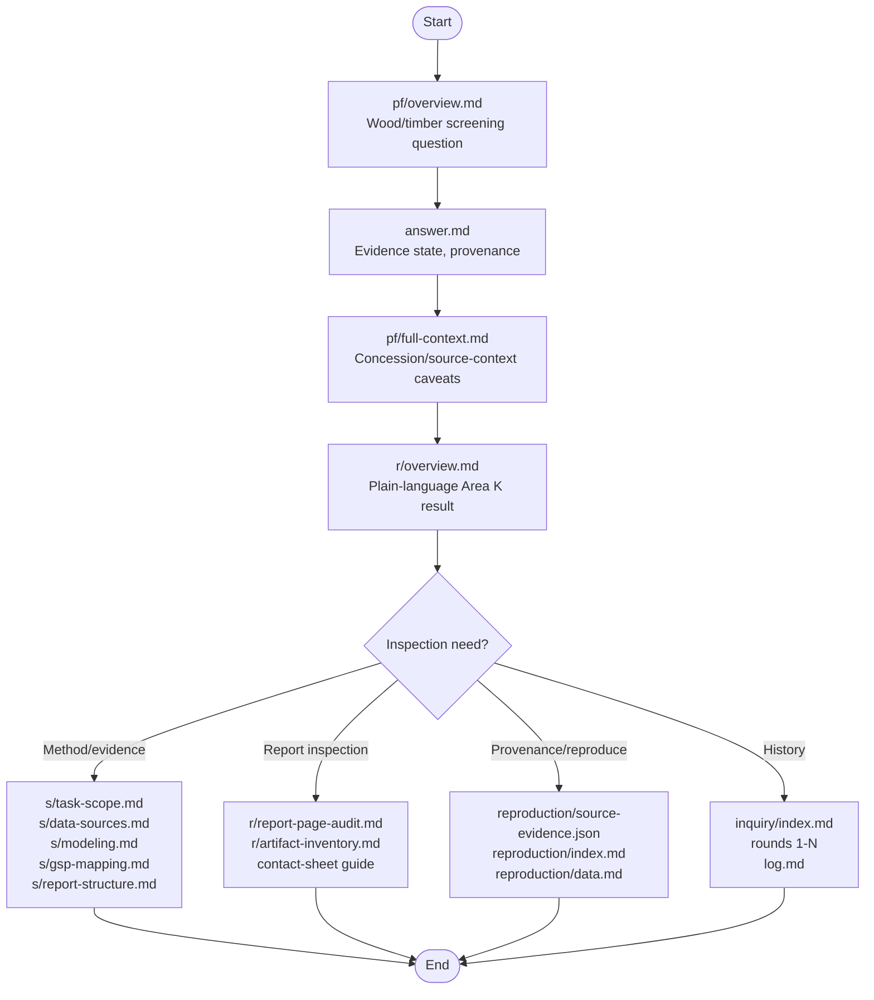

# Liberia FMC Area K Bundle Reading Guide

Use this order when inspecting the source bundle.

## Reading Flow

1. Read [pf/overview.md](pf/overview.md) for the wood/timber screening question.
2. Read [answer.md](answer.md) for the current evidence state and provenance.
3. Read [pf/full-context.md](pf/full-context.md) for the concession/source-context caveats.
4. Read [r/overview.md](r/overview.md) for the plain-language Area K result.

Then branch by inspection need:

- Method/evidence: [s/task-scope.md](s/task-scope.md), [s/data-sources.md](s/data-sources.md),
  [s/modeling.md](s/modeling.md), [s/gsp-mapping.md](s/gsp-mapping.md), and
  [s/report-structure.md](s/report-structure.md).
- Report inspection: [r/report-page-audit.md](r/report-page-audit.md) and
  [r/artifact-inventory.md](r/artifact-inventory.md).
- Provenance/reproduction: [reproduction/source-evidence.json](reproduction/source-evidence.json),
  [reproduction/index.md](reproduction/index.md), and [reproduction/data.md](reproduction/data.md).
- Inquiry/evolution: [inquiry/index.md](inquiry/index.md), then
  [inquiry/round-0001.md](inquiry/round-0001.md) through
  [inquiry/round-0008.md](inquiry/round-0008.md).

In a published snapshot, open the copied `report.html` in `evidence-package/` for offline
inspection. The source bundle does not copy counterpart evidence artifacts; the published snapshot
may contain a verified `evidence-package/` copy after handoff verification.
